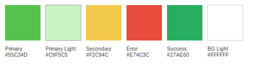
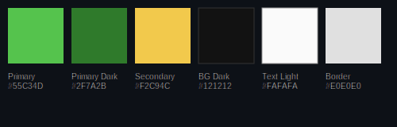

# دليل الأسلوب البصري (Style Guide)

> يوضح هذا الدليل الألوان، الخطوط، ونمط المكوّنات حتى يبقى تطبيق «وسط» متناسق ويعكس شخصيّته الودودة والمحلية.

---

## 1. الهوية (Logo Usage)

| النسخة على خلفية فاتحة | النسخة على خلفية داكنة | الاستخدام |
| --- | --- | --- |
|  |  | • نسخة `logo-dark` تُستخدم على خلفيات فاتحة أو شفافة. • نسخة `logo-light` تُستخدم على خلفيات داكنة. |

قواعد:
1. لا تغيّر التناسب؛ حافظ على الأبعاد الأصلية.  
2. الحد الأدنى لحجم الأيقونة داخل التطبيق 48 px.  
3. اترك **Padding** حول الشعار = نصف عرضه على الأقل.

---

## 2. لوحة الألوان (Color Palette)

| الدور | HEX | شرح مختصر |
| --- | --- | --- |
| Primary | `#55C34D` | أخضر لايم – يرمز للثقة والنمو. |
| Primary Dark | `#2F7A2B` | يُستخدم للنصوص الرئيسية في الوضع الداكن. |
| Primary Light | `#C9F5C5` | Hover وخلفيات ثانوية. |
| Secondary | `#F2C94C` | ذهبي خفيف للعناصر المميزة. |
| Error | `#E74C3C` | رسائل الخطأ. |
| Success | `#27AE60` | نجاح العمليات. |
| Text Dark | `#333333` | نص أساسي على الخلفية الفاتحة. |
| Text Light | `#FAFAFA` | نص على الخلفية الداكنة. |
| BG Light | `#FFFFFF` | خلفية الوضع الفاتح. |
| BG Dark | `#121212` | خلفية الوضع الداكن. |
| Border | `#E0E0E0` | حدود Inputs والبطاقات.

### 2.1 معاينة الوضع الفاتح

  

### 2.2 معاينة الوضع الداكن

  

---

## 3. الخطوط (Typography)

| الاستخدام | العربية (Cairo) | اللاتينية (Montserrat) | الوزن | الحجم |
| --- | --- | --- | --- | --- |
| H1 | Bold | Bold | 700 | 32 px |
| H2 | SemiBold | SemiBold | 600 | 24 px |
| H3 | SemiBold | SemiBold | 600 | 20 px |
| Body | Regular | Regular | 400 | 16 px |
| Caption | Light | Light | 300 | 14 px |
| Button | SemiBold | SemiBold | 600 | 16 px |

### عينات الخط  

  

- واجهة عربية تستخدم RTL.
- تُعرف العائلات في `pubspec.yaml` وتطبّق عبر `TextTheme`.

---

## 4. Spacing & Radius

| العنصر | القيمة |
| --- | --- |
| Base Unit | 8 px |
| Space بين البطاقات | 16 px |
| Padding جانب الشاشة | 24 px |
| Corner Radius | 12 px |

---

## 5. مكوّنات UI مختارة

### 5.1 زر أساسي
- خلفية Primary، نص أبيض، ظل 2dp.  
- عند الضغط اللون يتغير إلى `Primary Dark` بنسبة 80%.

### 5.2 بطاقة خدمة
- صورة 120×120 px، Radius 12 px.  
- أسفلها العنوان بحجم 20 px، السعر 16 px، تقييم نجوم.

### 5.3 Dialog تأكيد
- خلفية `#FFFFFF`، Radius 20 px.  
- زر “إلغاء” مفرغ، زر “تأكيد” Primary ممتلئ.

---

## 6. لقطات الشاشة

*لقطات فعلية من التطبيق ستُضاف لاحقاً بعد اكتمال التصميم النهائي.*

---

## 7. إدارة الأصول (Assets)

| النوع | المسار | ملاحظة |
| --- | --- | --- |
| شعارات | `assets/images/logo-*.png` | تستورد بـ `flutter_svg` أو `Image.asset`. |
| أيقونات | `assets/icons/*.svg` | مسطّحة بدون ألوان مدمجة و تُلوَّن بالـ `ColorFilter`. |
| خطوط | `assets/fonts/` | Cairo & Montserrat بكل الأوزان. |

> بعد الموافقة، نستخرج أكواد الألوان ونسجلها في ملف `theme.dart`.

